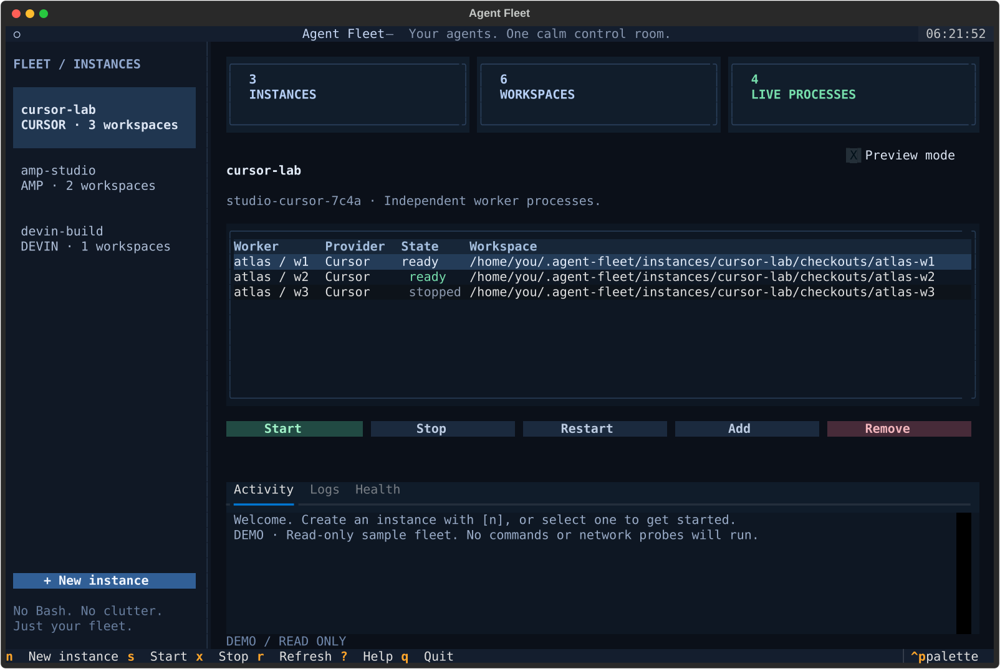
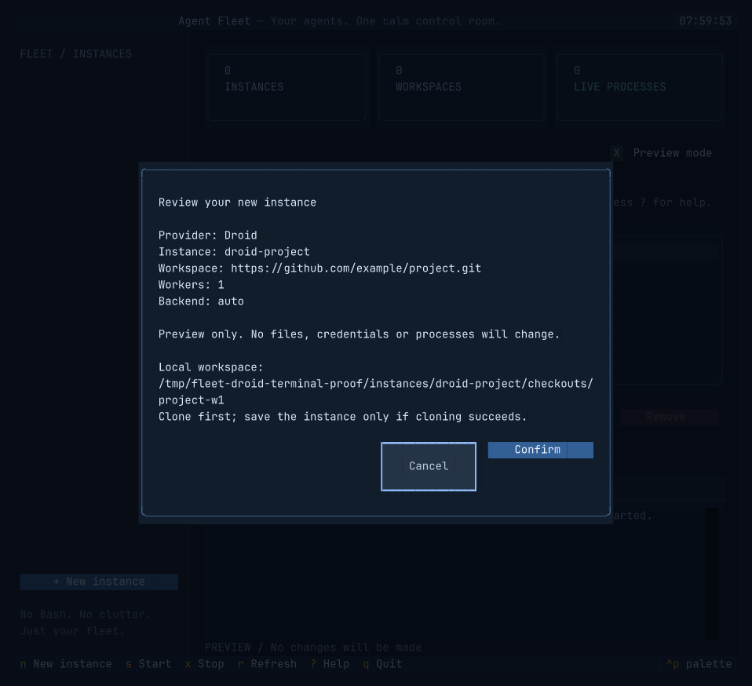

# Agent Fleet

**Your agents. One calm control room.**

A native Python + [Textual](https://textual.textualize.io/) terminal app for managing
Cursor Workers, Devin Outposts, Amp Runners and Factory Droid Computers on Linux.
No Bash wrapper. No automatic installer scripts. No clutter.



## Quick start

Requires **Python 3.11+**, Linux (or WSL2), and Git for managed checkouts.

```console
uv tool install git+https://github.com/DylanLIiii/agent-fleet
agent-fleet
```

Or with pipx:

```console
pipx install git+https://github.com/DylanLIiii/agent-fleet
agent-fleet
```

Try the interface without credentials, files or provider calls:

```console
agent-fleet --demo
```

Install and authenticate your provider CLI separately before starting agents.
Setup can prepare configuration and workspaces before a provider CLI is installed.

## Designed for humans

- A dark, restrained dashboard with instance navigation, live process counts and clear readiness.
- Keyboard and mouse support, searchable command palette (`ctrl+p`), and responsive layouts.
- The header is noninteractive; clicking its left edge no longer opens the command palette.
- A guided setup form with provider-specific fields, masked credentials and a review step.
- Start, stop, restart, add and remove without leaving your terminal.
- Separate activity, log and health panels. No shell interpretation or Rich markup of log content.
- Preview mode (`p` or `--dry-run`) shows intended actions without changing local or remote state.
- Removal confirmations default to keeping your workspaces.
- Background workers survive closing the dashboard; use **stop** to end them.

### Providers

| Provider | Process model | Readiness evidence |
| --- | --- | --- |
| Cursor | One worker per independent checkout, data directory and management port | Local `/readyz` |
| Devin | One Outpost worker per workspace; repository under `repos/` | Process alive; remote readiness unverified |
| Amp | **One runner** serving its checkouts, your own directories and Amp-discovered checkouts | Matching runner in `amp runner list --json` |
| Droid | **One Computer per Fleet home**, using a local directory or a managed Git clone | Local `daemon.loopback` diagnostic |

Only one Droid registration is supported by the provider per machine. Do not create
another using a different Fleet home or outside this application.
Local readiness never promises that a provider is authenticated or accepting remote
tasks. Confirm dispatch on the provider platform.

## Keyboard guide

| Key | Action |
| --- | --- |
| `n` | New instance |
| `s` / `x` | Start / stop selected worker |
| `ctrl+r` | Restart selected worker |
| `a` | Add workers to selected instance |
| `e` | Manage Amp directories |
| `delete` | Remove selected worker |
| `r` | Refresh |
| `l` / `d` | Logs / health |
| `p` | Toggle preview mode |
| `?` | Help |
| `ctrl+p` | Command palette |
| `q` | Quit |

Amp and Droid row actions affect the shared runner, not just one directory.

## Scriptable, too

Options `--home`, `--instance` and `--dry-run` go **before** the subcommand.

```console
agent-fleet setup --provider cursor --name cursor-lab \
  --source git@github.com:you/project.git --count 4
agent-fleet --instance cursor-lab start all
agent-fleet status --json
agent-fleet list
agent-fleet --instance cursor-lab logs 1 --lines 80
agent-fleet --instance cursor-lab doctor
agent-fleet --instance cursor-lab stop all
agent-fleet --instance cursor-lab add 2
agent-fleet --instance cursor-lab repair
agent-fleet --instance cursor-lab credential
agent-fleet --instance cursor-lab --dry-run remove 1
agent-fleet --instance cursor-lab remove 1
```

Amp instances can serve directories that Fleet never clones — existing worktrees
and local projects — and can let Amp discover checkouts on its own:

```console
agent-fleet setup --provider amp --name amp-lab \
  --source git@github.com:you/project.git --count 2 \
  --extra-dir /home/you/worktrees/topic \
  --discover /home/you/code --discover-depth 3 --discover-exclude dotfiles
agent-fleet --instance amp-lab dirs
agent-fleet --instance amp-lab dirs add /home/you/worktrees/other
agent-fleet --instance amp-lab dirs remove /home/you/worktrees/topic
agent-fleet --instance amp-lab dirs discover /home/you/more --depth 2
agent-fleet --instance amp-lab dirs discover --clear
```

Use `--backend process` or `--backend systemd` at setup to override auto-detection.
For Devin, add `--outpost NAME`; the token is requested using a masked prompt.
For Droid, use `--source /absolute/local/path` to reuse a directory, or a Git URL
to clone it automatically. The worker count is always one:

```console
agent-fleet setup --provider droid --name droid-project \
  --source https://github.com/you/project.git
```

Droid Git sources are cloned into
`~/.agent-fleet/instances/<name>/checkouts/<repo>-w1` (or your chosen Fleet home).
The setup review shows this path. Clone failure leaves the instance unconfigured;
no existing directory is overwritten and nothing starts automatically.
Droid workspaces are kept on removal, whether reused or cloned.



Pass an existing local Git directory as `--source` to derive its origin and prepare
independent Cursor/Devin/Amp clones. Existing source directories are never overwritten.

`--gpu-split` sets `CUDA_VISIBLE_DEVICES` for independent Cursor/Devin workers,
including an empty value for workers without an assigned GPU. Amp's single process
cannot isolate GPUs per checkout; all its directories share one GPU environment.
Stop all workers before scaling an instance with GPU allocation enabled.

## Amp directories

An Amp instance runs one runner that serves directories, not one process per
directory. It always serves its managed checkouts, and it can serve more:

- **Extra directories** (`--extra-dir`, `agent-fleet dirs add`, `e` in the
  dashboard) are existing folders — worktrees, local projects, anything
  absolute. Fleet never clones or deletes them. While the runner is up, adding
  and removing them takes effect immediately through `amp runner dirs add` and
  `amp runner dirs remove`.
- **Discovery** (`--discover`, `agent-fleet dirs discover`) lets Amp serve every
  Git checkout up to two levels beneath a root, including registered worktrees.
  Depth (`--discover-depth`, 1–10) and exclusions (`--discover-exclude`, in
  `.gitignore` style) tune the scan. Discovery is set when the runner starts.

Fleet keeps the runner's directory list in sync with the instance configuration
whenever it starts one, so directories added outside Fleet are dropped at the
next start. Add them with `agent-fleet dirs add` to keep them. Worker checkouts
still change only while the runner is stopped.

## State and safety

The default Fleet home is `~/.agent-fleet`. Override it with `FLEET_HOME` or `--home`.
It must be an absolute, non-root path with no symlink components.

```text
~/.agent-fleet/
  .lock
  instances/<name>/
    fleet.json             # configuration, permissions 600
    cursor-api-key         # optional private credential
    devin-token            # private credential
    checkouts/             # Cursor / Amp / Git-source Droid clones
    devin-workers/         # Devin workers, each containing repos/
    data/                  # isolated Cursor data directories
    run/                   # PID + Linux process birth-time identity
    logs/                  # rotating private logs, 10 MiB × 4 files per process
```

- A fleet-wide nonblocking lock serializes mutations.
- Linux process birth times protect against signaling a reused PID.
- Systemd units contain only the Python supervisor command, never stored credentials.
- Detached workers use a Python supervisor with signal forwarding and rotating logs.
  The dashboard does not need to stay open.
- Provider-required token arguments may still be visible in the provider process's
  command line to other processes with sufficient permissions. Use a trusted host.
- `remove` keeps checkouts by default. `--delete-checkouts` additionally requires a
  matching ownership marker and origin, no modified/untracked/ignored files, and no
  unpushed branch commits. Droid's existing directory is **never** deleted.
- Logs, credentials and provider data survive removal. Remove those manually only
  after reviewing them. Third-party logs may contain other sensitive content.
- Private files must be owned by the current user and have restrictive permissions.
- Agents are powerful remote-access tools, not sandboxed by Fleet. Only start them
  on machines and repositories you intend to expose to the provider.

Systemd user services support automatic recovery. To start them after reboot without
logging in, enable lingering yourself: `loginctl enable-linger "$USER"`.
Detached processes require a manual `start` after a machine reboot.
`READY_TIMEOUT` controls startup readiness timeout in seconds (default: 20).
`CLONE_TIMEOUT` controls each clone attempt in seconds (default: 300).
For large repositories, use `CLONE_TIMEOUT=1800 agent-fleet`.
The dashboard and CLI show Git clone phases and percentages while preparing a workspace.
Errors identify authentication/access, DNS, transfer, TLS and local disk problems without
printing Git's raw output, which can contain credentials. Unknown errors remain classified
as unknown rather than guessed. Transient DNS/transfer failures retry up to three times;
authentication, disk and timeout failures stop immediately. Failed clones leave no instance
configuration; their temporary directories are cleaned up and transport processes stopped.
Quitting the dashboard also cancels an in-progress clone, including a silent Git transfer.

## Moving from the Bash script

Inspired by [DylanLIiii's agent-fleet.sh](https://gist.github.com/DylanLIiii/aca0bd97fb0147c78f03ddc3883f4722),
specifically revision `5f4d34f7c13750210bd6e3e099ee3114cf114055`.
This is a Python reimplementation, not an execution wrapper.

Existing `fleet.env` files at the Fleet root or under `instances/<name>/` are read
in place. Configurations from the linked script revision preserve their worker
names, PID records, service names and management ports. Literal quoted/escaped
assignments are parsed **without executing Bash**.
Shell substitutions, custom commands and Bash ANSI-C quotes are not supported.
Legacy files must have permissions `600` and be owned by you.

Earlier Cursor scripts used `run/<repo>-wN.pid` with only a PID and often permissions
`644`. Fleet checks the live process's owner, provider, worker name and workspace,
then displays **legacy running** instead of falsely reporting **stopped**.
These workers remain **read-only**: Fleet will not signal, replace, remove, or start
a duplicate while an old record exists. A live PID that fails identity checks is
shown as **unverified PID**, not running or ready.
Manage them with the original Bash script. After stopping them, review the old
records before manually removing them and starting Python-managed workers.
Fleet never rewrites or adopts old PID-only records automatically.
Amp still requires its own matching process/service record; no Amp runner is
started merely because the dashboard reports stopped.

Do not run the Bash and Python managers simultaneously. Do not place both
`fleet.json` and `fleet.env` in one instance. No migration starts or restarts workers.
Use `repair` to fill missing workspaces. New instances use JSON.

Intentional improvements over the script: no `curl | bash`, credentials omitted
from generated units, masked setup fields, explicit setup review, checkout retention
by default, and deletion protection for unpushed commits. Fixed-size log rotation
replaces the script's `LOG_*` environment settings.

## Development

```console
git clone https://github.com/DylanLIiii/agent-fleet
cd agent-fleet
uv sync --group dev
uv run agent-fleet --demo
uv run pytest
uv run ruff check .
uv run ruff format --check .
uv run python -m build
```

Tests use temporary local repositories and fake provider executables. They never
authenticate, register a remote machine or dispatch a real task.

## License

MIT. See [LICENSE](LICENSE).
